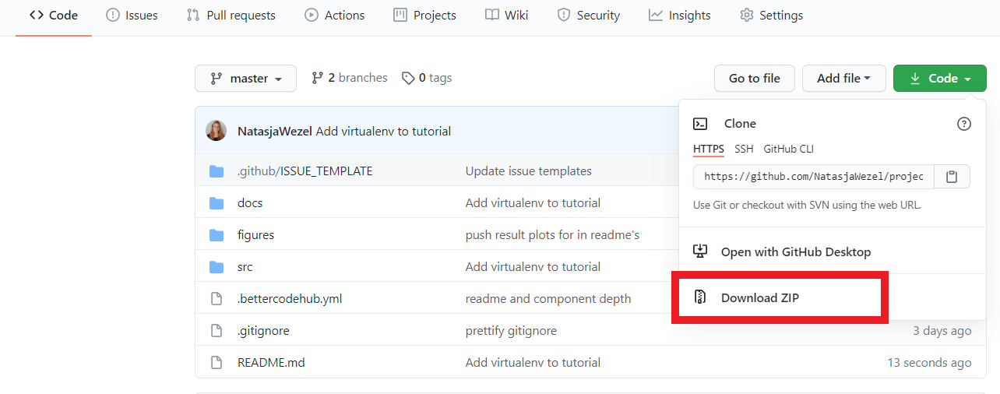
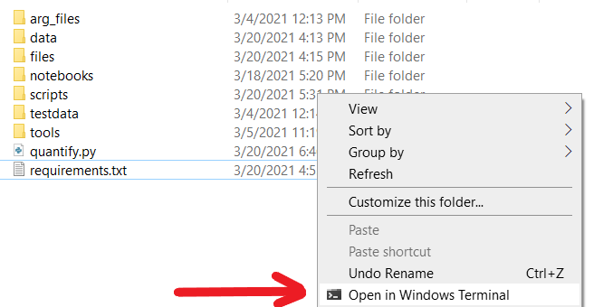
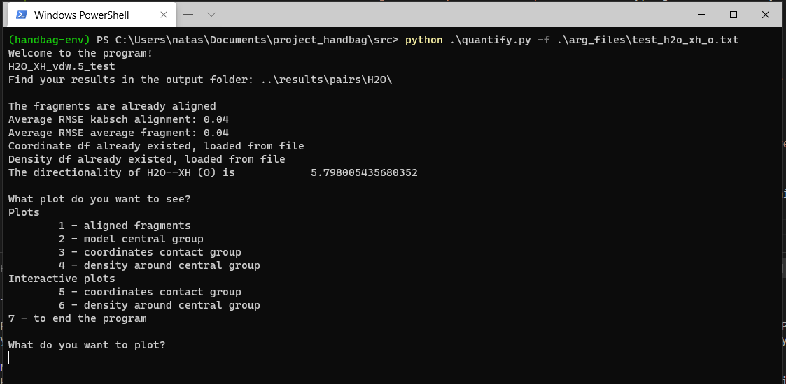

# How to use the Command Line Interface (CLI) of project: Handbag
- [How to use the Command Line Interface (CLI) of project: Handbag](#how-to-use-the-command-line-interface--cli--of-project--handbag)
  * [Installing the project](#installing-the-project)
  * [Setting up a virtual environment and install the dependencies of this project](#setting-up-a-virtual-environment-and-install-the-dependencies-of-this-project)
  * [Testing the installation](#testing-the-installation)
  * [Tips for using the terminal](#tips-for-using-the-terminal)
  * [How the program runs](#how-the-program-runs)
      - [Question 1: How would you run the program in the same way, without using the argument file?](#question-1--how-would-you-run-the-program-in-the-same-way--without-using-the-argument-file-)
      - [Question 2: How would you run the program with using the hydrogen atom as reference point, without using the argument file?](#question-2--how-would-you-run-the-program-with-using-the-hydrogen-atom-as-reference-point--without-using-the-argument-file-)
      - [Question 3: How would you run the program with the NO<sub>3</sub> R<sub>2</sub>CO file, that is also located in test data? Use the oxygen atom of the carbonyl as reference point.](#question-3--how-would-you-run-the-program-with-the-no-sub-3--sub--r-sub-2--sub-co-file--that-is-also-located-in-test-data--use-the-oxygen-atom-of-the-carbonyl-as-reference-point)
  * [Making your own argument files](#making-your-own-argument-files)
  * [How to specify labels](#how-to-specify-labels)
      - [Question: What would you fill in for RC6H5, as shown in the picture above?](#question--what-would-you-fill-in-for-rc6h5--as-shown-in-the-picture-above-)
      - [Question: How would you run the program with RC6H5, with as contact reference point the oxygen atom of CO?](#question--how-would-you-run-the-program-with-rc6h5--with-as-contact-reference-point-the-oxygen-atom-of-co-)
  * [What to do when the name of the cor file has the wrong format](#what-to-do-when-the-name-of-the-cor-file-has-the-wrong-format)
      - [Question: What would you fill in in central_groups.csv for RCOMe, as shown in the picture above?](#question--what-would-you-fill-in-in-central-groupscsv-for-rcome--as-shown-in-the-picture-above-)
      - [Question: How would you now run this program?](#question--how-would-you-now-run-this-program-)

## Installing the project
The steps you need to undertake to run the CLI are summarized in bullet points. In the end, some example questions are given so you can get familiar with running the program for your own data. Let's start with obtaining the source code and installing python and a terminal.

* Install python **3.8.8** [here](https://www.python.org/downloads/release/python-388/). Scroll down and click the Windows 64-bit installer.

> As per writing, 3.8.8 is not the newest python version; however some of the dependencies of this project are not yet implemented in the very new python 3.9.

* Install Windows terminal from the Microsoft Marketplace or click [here](https://www.microsoft.com/en-us/p/windows-terminal/9n0dx20hk701?activetab=pivot:overviewtab).

* Download the source code of this page by using the green download button on the github page, as shown below.



## Setting up a virtual environment and install the dependencies of this project
* Navigate to the src folder in file explorer and open a windows terminal by right clicking the white space in the folder and choosing open Windows Terminal.</br>

* Create your virtual environment by typing ```python -m venv handbag-env``` and pressing enter. It might take some time.  

> You can always copy the commands in this tutorial and paste them into your terminal using *Cntrl + V* or right-clicking on the command line. However, try to get used to typing on the command line as well with this tutorial.

* Activate the virtual environment with: ```./handbag-env/Scripts/Activate.ps1```. While typing folder names, you can always use 'tab' to let the terminal auto-complete the filepath you're typing. When the virtual environment is activated, this should be visible in green parentheses at the very beginning of your command line, like in the picture below.

> From now on, we will not say "and press enter" everywhere. It is implicit that the commands need to be executed by pressing enter.


* Install dependencies of the project: ```pip install -r requirements.txt```. This can take a bit of time.

* You can deactivate the virtual environment with saying ```deactivate```.

> It's also okay to just close the terminal once your done using the program.

* Activate the virtual environment again with ```.\handbag-env\Scripts\Activate.ps1```.

> Now that you have created the virtual environment, from now on you can just open the terminal in the src folder and only use this command to activate the virtual environment.

## Testing the installation
Test if everything works with running: ```python .\quantify.py -f .\arg_files\test_h2o_xh_o.txt```. If everything worked correctly, the program should now start to run and you should be able to explore all the plots.


## Tips for using the terminal
```cd```: changes directory. </br>
```ls```: list. List all files and directories that are in the current directory. This can help you navigate through the file structure on your computer.</br>
```Arrow up```: using the arrow up key on your keyboard you can "scroll" through the latest commands you entered, and executing them again by pressing enter.</br>
```Tab```: Tab is used for autocompletion, which (together with the up-arrow) can save you a lot of typing :).

* Change to the directory containing the testdata by typing ```cd test```, pressing tab (```cd .\testdata\``` should appear on your command line) and execute the command with pressing enter.
* Go back to the src folder with using ```cd ../```

> ```../``` means óne folder "up", so: move to the parent directory of the folder you're currently in.

* Press the arrow up key twice to copy the ```cd testdata``` command and execute it again
* Type ```ls``` to see what testdata is in this folder
  * If you want, ```cd``` to one of those folders and use ```ls``` to see what's in it. (A .cor and a .csv file)
  * To go back to the src folder, use  ```cd ../../``` instead of the next command.
* Go back to the src folder with using ```cd ../```

> In windows terminal, filepaths can be with forward slashes ```/```` or backward slashes ```\```. It doesn't matter which one you use when typing a filepath, however, using tab will change all slashes to forward slashes.

## How the program runs
You tested the program with the command: ```python .\quantify.py -f .\arg_files\test_h2o_xh_o.txt```, but how does this command work? The flag ```-f``` specifies a file that contains the input arguments for the program.

Start with running: ```python .\quantify.py --help```. Here you can see the input arguments that the program needs. There are two required arguments: you need to specify the path to the input file with the flag `-i/--input`, and secondly you need to specify the reference point from the contact group with the `-crp/--contact_rp`. The other flags are optional and we will dive into them later.

If we look into the file `.\arg_files\test_h2o_xh_o.txt` (by opening it with any text editor you like), we see the following input:
```
--input .\testdata\H2O\H2O_XH_vdw.5_test.cor
--contact_rp O
```

#### Question 1: How would you run the program in the same way, without using the argument file?
<details>
  <summary>Answer question 1</summary>
  On the command line, type:

  ```python .\quantify.py --input .\testdata\H2O\H2O_XH_vdw.5_test.cor --contact_rp O```

  and press enter
</details>

#### Question 2: How would you run the program with using the hydrogen atom as reference point, without using the argument file?
<details>
  <summary>Answer question 2</summary>
  On the command line, type:

  ```python .\quantify.py --input .\testdata\H2O\H2O_XH_vdw.5_test.cor --contact_rp H```

  and press enter
</details>

#### Question 3: How would you run the program with the NO<sub>3</sub> R<sub>2</sub>CO file, that is also located in test data? Use the oxygen atom of the carbonyl as reference point.
<details>
  <summary>Answer question 3</summary>
  On the command line, type:

  ```python .\quantify.py --input .\testdata\NO3\NO3_R2CO_vdw.5_test.cor --contact_rp O```

  and press enter
</details>

## Making your own argument files
Implement both `.\arg_files\test_h2o_xh_h.txt` and `.\arg_files\test_no3_r2co_o.txt`. *It is important that the flags are all on their own line!*
<details>
  <summary>Implementation .\arg_files\test_h2o_xh_h.txt</summary>
  The file has to contain two lines:

  `--input .\testdata\H2O\H2O_XH_vdw.5_test.cor
  --contact_rp H`
</details>

<details>
  <summary>Implementation .\arg_files\test_no3_r2co_o.txt</summary>
  The file has to contain two lines:

  `--input .\testdata\NO3\NO3_R2CO_vdw.5_test.cor 
  --contact_rp O`
</details>

<details>
  <summary>Running water XH, with hydrogen as reference point, with input argument file </summary>
  On the command line, type:

  ```python .\quantify.py -f .\arg_files\test_h2o_xh_h.txt```

  and press enter
</details>

<details>
  <summary>Running nitrogen with input argument file </summary>
  On the command line, type:

  ```python .\quantify.py -f .\arg_files\test_no3_r2co_o.txt```

  and press enter
</details>

## How to specify labels
For water and nitrogen, some other pre-work was already done. Open the ```central_groups.csv```, located in the files folder (with any text editor you like - in this case excel might be a good option). First look at what atom has which label.


Then look at the entries in the file. Underneath, a table is given to show the rows that the file contains. The first three atoms, center_label, y_axis_laben and xy_plane_label are the atoms that is aligned on. The first one goes on the origin (0,0,0), the second one goes on the y_axis (0,1.45,0) and the last one goes on the xy-plane (2.45, 1.56, 0). This is mostly for the visual aspect of looking at the structures later. The first structure is rotated into this position, and then is a base fragment to align all the other fragments on. For this, it is important that the three atoms have an angle with each other (they can not be on a line).

> If you have a linear group, still put an entry in all these three columns. If you have a group existing of two atoms, put one of them on the origin, and the other one in both rows. Nothing will happen, but the program needs an entry in the xy-plane column.
> The reason we ask for 3 non-linear atoms is, if you had 3 linear atoms is that you end up with a 2D overlay rather than a 3D one i.e. only 2 of the 3 orthogonal axes are defined. While you could in theory do this, it would give random positions for the contact group around the cone of the group.

| name  | center_label | y_axis_label | xy_plane_label | treat_as_R | R | bin |
| ----- | ---- |  ---- |  ---- |  ---- |  ---- |  ---- |
| H2O  | LAB1  | LAB2 | LAB3 | - | - | - |
| NO3  | LAB3  | LAB2 | LAB1 | - | - | - |

#### Question: What would you fill in for RC6H5, as shown in the picture above?

<details>
  <summary>Labels RC6H5</summary>
  In raw text format: 

  ```RC6H5,LAB2,LAB4,LAB6,-,LAB1,-```

Note: multiple answers are correct. As long as the first three atoms are not on a line, and LAB1 is in the column 'R'.
</details>

Now that you've added this line to the central_groups.csv, it is possible to run the program with this central group as well.

#### Question: How would you run the program with RC6H5, with as contact reference point the oxygen atom of CO?
<details>
  <summary>How would you </summary>
  On the command line, run:

  ```python .\quantify.py -i .\testdata\RC6H5\RC6H5_R2CO_vdw.5_test.cor -crp O```
  
  or make an argument file and run:
  
  ```python .\quantify.py -f .\arg_files\test_rc6h5_r2co_o.txt```
</details>

## What to do when the name of the cor file has the wrong format
As a final example, we'll try to run the program for the 'search6' data. Of course, you know what data it contains: you did the conquest search. It contains the data of a carbonyl and a methyl group (let's call it rcome) and an aryl group. However, you didn't give a name in the right format. (In this case, search6 is not that helpful at all to remember what search this was.)

First, add the labels to the central_groups.csv file. We want to ignore the hydrogen atoms of the methyl group. (See thesis/article for the reasoning about this.)


#### Question: What would you fill in in central_groups.csv for RCOMe, as shown in the picture above?
Tip: You can fill in multiple labels in a single column by separating them with a dash: '-'.
<details>
  <summary>Labels RCOMe</summary>
  In raw text format: 

  ```RCOMe,LAB1,LAB2,LAB3,-,LAB4,LAB5-LAB6-LAB7```

Note: multiple answers are correct. As long as the first three atoms are not on a line, and LAB1 is in the column 'R'.
</details>

#### Question: How would you now run this program?
You can make use of the ```--central/--contact``` input flags. Try to write an input argument file named ```.\arg_files\test_rcome_r2co_o.txt```.

<details>
  <summary>Input argument file for search6 (RCOMe_R2CO) </summary>
  The file must contain:

  ```
  --input .\testdata\test\search6.cor 
  --contact_rp O
  --central RCOMe
  --contact R2CO
  ```
</details>

> If the .csv containing the parameters from the conquest search has another name, you can specify that as well with using the --labels flag. So say search6.csv was called search6_labels.csv instead, the program is not able to find it automatically. You'd need to specify --labels search6_labels.csv (or rename the file).


## Plotting the first fragment with labels
Looking at the first fragment with labels can come in handy when you forgot how you specified the labels. A script is provided to make this plot, in the ```tools``` folder. 
> This action can only be done if the .csv file has the same filename as the .cor file, and have the CENTRAL_CONTACT_blahblah format

* ```cd tools```
* ```python plot_first_fragment_labels.py ..\testdata\h2o\H2O_XH_vdw.5_test.cor```

A plot like the ones above should show.

## Building a methyl model
If you choose to not use the hydrogen atoms from a methyl group for alignment, you can specify where they need to be build back in ```files\methyl_model.csv```. If you do want to use the regular generation of the central group model, do not put the labels in the bin column in ```files\central_groups.csv``` and do not specify the central group name here. The model will be built using K-means. See thesis for pro's/con's of both of these methods.

This is the end of the tutorial, have fun calculating directionalities and inspecting densities around central group models! :)
